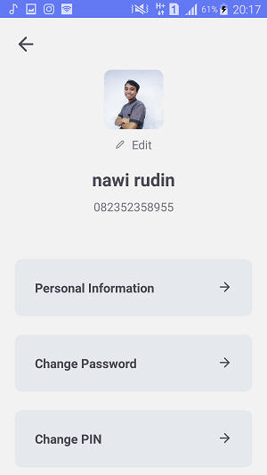
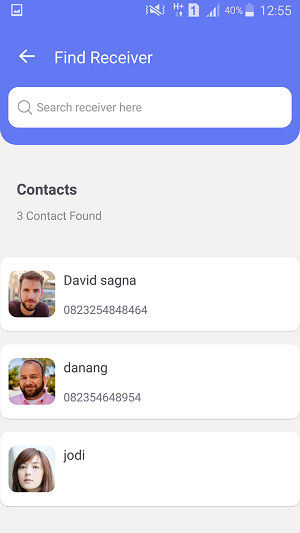
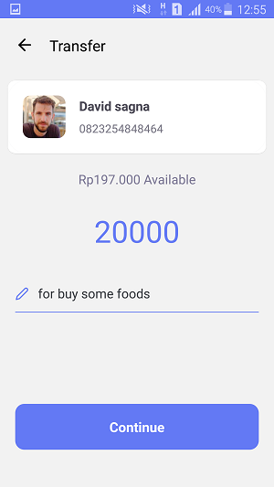

<h1 align="center">Zwallet</h1>

  Built with React Native.

## Table of Contents

- [Table of Contents](#table-of-contents)
- [Introduction](#introduction)
- [Features](#features)
- [Requirements](#requirements)
- [Usage for development](#usage-for-development)
- [Screenshots](#screenshots)
- [Release APK Debug](#release-apk-debug)
- [Contributors](#contributors)

## Introduction
<b>Zwallet</b> is a digital wallet application where users can make transfers and top-ups to other contacts / users who use Zwallet. This application runs on the android operating system

## Features
* Users must sign in before use this app
* Users can transfer to other contact
* Users can top up money(coming soon)
* And others

## Requirements
* [`npm`](https://www.npmjs.com/get-npm)
* [`react-native`](https://facebook.github.io/react-native/docs/getting-started)
* [`react-native-cli`](https://facebook.github.io/react-native/docs/getting-started)

## Usage for development
1. Open your terminal or command prompt
2. Type `https://github.com/NawiOne/Zwallet.git`
3. Open the folder and type `npm install` for install dependencies
4. Type `npm run android` for run this app. ***Make sure your device is connected with debugging mode***.

## Screenshots

       
    
    
    

## Release APK Debug

## Contributors

  <table>
    <tr>
      <td align="center">
        <a href="https://github.com/NawiOne">
           
          <b>Nawirudin</b>
        </a>
      </td>
    </tr>
  </table>

